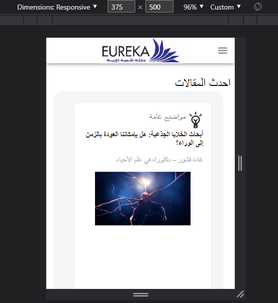

# Eureka Magazine Scientific

This is my first official project using React JS. Eureka Magazine is the digital version of scientific magazine, issued annually in the Lebanese University - Faculty of Engineering , with an impressive content about science in general, and engineering espacially.

## Table of contents

- [Overview](#overview)
  - [Link](#link)
- [My process](#my-process)
  - [Built with](#built-with)
  - [What I learned](#what-i-learned)
- [Author](#author)
- [Feedback](#feedback)
- [Getting Started with Create React App](#getting-started-with-create-react-app)

## Overview

This magazine contains scientific articles published, news of faculty, club events and all versions of this magazine.

### Link

[Live Demo](https://eureka-app.netlify.app/)

### Desktop Design

### Mobile Design

## My process
### Built with
- React JS.
- [Material UI](https://mui.com/)
- [react-carousel-minimal](https://www.npmjs.com/package/react-carousel-minimal)
- [react-player](https://www.npmjs.com/package/react-player)
- [react-social-icons](https://www.npmjs.com/package/react-social-icons)

### What I learned
It was quite a challenge for me in the choice of design, layout, components and libraries, as well as in requirements analysis.
I have learned:
- How to use Material UI and other libraries in my project to increase my productivity.
- Communication with customers and understanding their requirements.
- Dealing with responsive design.
- Dealing with JSON format of data.

## Author
- Linked In Profile : [Alaa Ballout](https://www.linkedin.com/in/alaa-ballout/)
- Contact us : [alaaballoutdev@gmail.com](mailto:alaaballoutdev@gmail.com)

## Feedback
I will be grateful to any feedback or any recommendation from you.
Don't hestiate to contact me : [alaaballoutdev@gmail.com](mailto:alaaballoutdev@gmail.com)

## Getting Started with Create React App

This project was bootstrapped with [Create React App](https://github.com/facebook/create-react-app).

### Available Scripts

In the project directory, you can run:

#### `npm start`

Runs the app in the development mode.\
Open [http://localhost:3000](http://localhost:3000) to view it in the browser.

The page will reload if you make edits.\
You will also see any lint errors in the console.

#### `npm test`

Launches the test runner in the interactive watch mode.\
See the section about [running tests](https://facebook.github.io/create-react-app/docs/running-tests) for more information.

#### `npm run build`

Builds the app for production to the `build` folder.\
It correctly bundles React in production mode and optimizes the build for the best performance.

The build is minified and the filenames include the hashes.\
Your app is ready to be deployed!

See the section about [deployment](https://facebook.github.io/create-react-app/docs/deployment) for more information.

#### `npm run eject`

**Note: this is a one-way operation. Once you `eject`, you can’t go back!**

If you aren’t satisfied with the build tool and configuration choices, you can `eject` at any time. This command will remove the single build dependency from your project.

Instead, it will copy all the configuration files and the transitive dependencies (webpack, Babel, ESLint, etc) right into your project so you have full control over them. All of the commands except `eject` will still work, but they will point to the copied scripts so you can tweak them. At this point you’re on your own.

You don’t have to ever use `eject`. The curated feature set is suitable for small and middle deployments, and you shouldn’t feel obligated to use this feature. However we understand that this tool wouldn’t be useful if you couldn’t customize it when you are ready for it.

### Learn More

You can learn more in the [Create React App documentation](https://facebook.github.io/create-react-app/docs/getting-started).

To learn React, check out the [React documentation](https://reactjs.org/).

#### Code Splitting

This section has moved here: [https://facebook.github.io/create-react-app/docs/code-splitting](https://facebook.github.io/create-react-app/docs/code-splitting)

#### Analyzing the Bundle Size

This section has moved here: [https://facebook.github.io/create-react-app/docs/analyzing-the-bundle-size](https://facebook.github.io/create-react-app/docs/analyzing-the-bundle-size)

#### Making a Progressive Web App

This section has moved here: [https://facebook.github.io/create-react-app/docs/making-a-progressive-web-app](https://facebook.github.io/create-react-app/docs/making-a-progressive-web-app)

#### Advanced Configuration

This section has moved here: [https://facebook.github.io/create-react-app/docs/advanced-configuration](https://facebook.github.io/create-react-app/docs/advanced-configuration)

#### Deployment

This section has moved here: [https://facebook.github.io/create-react-app/docs/deployment](https://facebook.github.io/create-react-app/docs/deployment)

#### `npm run build` fails to minify

This section has moved here: [https://facebook.github.io/create-react-app/docs/troubleshooting#npm-run-build-fails-to-minify](https://facebook.github.io/create-react-app/docs/troubleshooting#npm-run-build-fails-to-minify)
